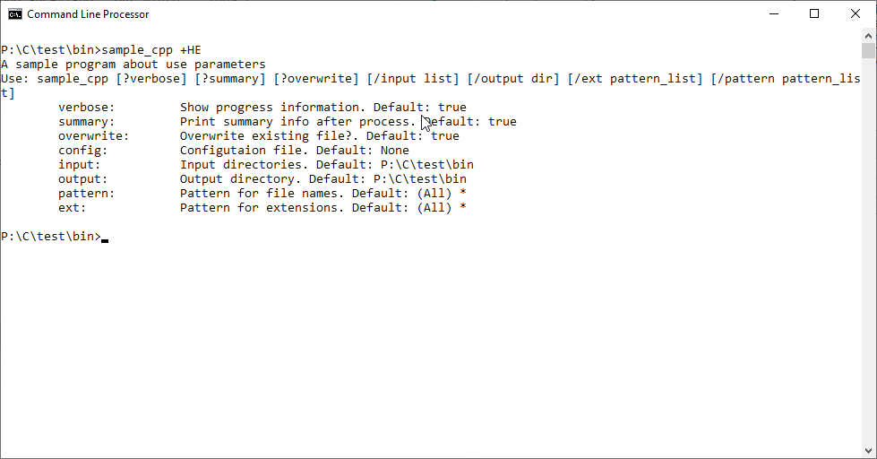

```{r setup, include=FALSE}
knitr::opts_chunk$set(echo = TRUE)
CPP="P:/C/cmdline/sample_exception_cpp/"
```

## Intro

Para mostrar el uso de la libreria se ha desarrollado un par de programas "muy poco funcionales" en C++ y en C


## Sample

El programa recopila un conjunto de ficheros de diferentes directorios y los copia en otro. 
Si se definen ciertas expresiones regulares o patrones, busca dentro de los archivos y aplica esos cambios

Las opciones que acepta son:


|  Nombre   | Tipo    | Defecto | Multiple |            Descripcion             |
|-----------|---------|---------|----------|------------------------------------|
| verbose   | Flag    | True    | True     | Mostrar informacion                |
| summary   | Flag    | True    | True     | Mostrar resumen                    |
| overwrite | Flag    | True    | True     | Sobreescribir ficheros existentes  |
| config    | Opcion  | N/A     | False    | Fichero de configuracion **existente** |
| input     | Opcion  | .       | True     | Directorio de entrada **existente** |
| output    | Opcion  | .       | True     | Directorio de salida               |
| pattern   | Opcion  | *       | True     | Patron de nombresde ficheros       |
| ext       | Opcion  | *       | True     | Patron de extensiones de ficheros  |
| ...       | Defines | N/A     | True     | Patrones de sustitucion            |


Para las pruebas se ha creado el siguiente entorno:

## Casos de uso

### Ayuda

El flag de ayuda está soportado por defecto en las siguientes versiones:

- -h
- --help
- +help
- +HELP

Notese que se soporta la forma clásica de ayuda: `-h` y `--help` por su uso extendido y por que no tiene sentido desactivar la ayuda: `-help`

#### Ayuda

En los casos en que la libreria se configura como sensible a mayúsculas se soporta dos tipos de ayuda a las que se ha denominado _simple_ y _detallada_, el objetivo es ofrecer la opcion de mostrar una ayuda mas simple o una ayuda mas detallada en función de las caracteristicas del programa.

#### Ayuda simple

Los siguientes comandos son equivalentes:

- sample -h
- sample --help
- sample +h
- sample +he
- sample +help


comando: `sample -h`

```{r echo=FALSE, fig.cap="Help detallado. Modo clasico", out.width = '100%'}

```

comando: `sample +h`

```{r echo=FALSE, fig.cap="Help detallado. Modo normal", out.width = '100%'}
knitr::include_graphics("samplecpp_help_02.png")
```

comando: `sample +he`

```{r echo=FALSE, fig.cap="Help detallado. Modo abreviado", out.width = '100%'}

```

comando: `sample +help`

```{r echo=FALSE, fig.cap="Help detallado. Modo completo", out.width = '100%'}
knitr::include_graphics("samplecpp_help_04.png")
```

#### Ayuda detallada

El objetivo es poder mostrar una ayuda mas detallada

Los siguientes comandos son equivalentes:

- sample --HELP
- sample +H
- sample +HE
- sample +HELP


comando: `sample --HELP`

```{r echo=FALSE, fig.cap="Help simple. Modo clasico", out.width = '100%'}
knitr::include_graphics("samplecpp_help_11.png")
```

comando: `sample +H`

```{r echo=FALSE, fig.cap="Help simple. Modo normal", out.width = '100%'}

```

comando: `sample +HE`

```{r echo=FALSE, fig.cap="Help simple. Modo abreviado", out.width = '100%'}

```

comando: `sample +HELP`

```{r echo=FALSE, fig.cap="Help simple. Modo completo", out.width = '100%'}

```


## Exceptions

En C++ los errores son gestionados a través de `CmdLineException`.
El programa ejemplo `sample_exceptions` no realiza ninguna función pero acepta todos los tipos preestablecidos de parámetros.

Por simplicidad unicamente se captura la excepción base, pero la salida indica el tipo de excepción concreta generada.


### Source code

- config.hpp
- showinfo.hpp
- showinfo.cpp
- sample_exceptions.cpp

#### config.hpp
```{cc, eval=FALSE}
#pragma once
#include <iostream>
#include "cmdline.hpp"

constexpr auto VERBOSE    = "verbose";
constexpr auto SUMMARY    = "summary";
constexpr auto FLAG       = "flag";
constexpr auto NUMBERS    = "numbers";
constexpr auto NUMBER     = "number";
constexpr auto DECIMAL    = "decimal";
constexpr auto DECIMALS   = "decimals";
constexpr auto DATE       = "date";
constexpr auto TIME       = "time";
constexpr auto DATETIME   = "datetime";
constexpr auto TIMESTAMP  = "timestamp";
constexpr auto DIRIN      = "dirIn";
constexpr auto DIROUT     = "dirOut";
constexpr auto FILEIN     = "fileIn";
constexpr auto FILEOUT    = "fileOut";
constexpr auto CONFIG     = "config";

using namespace cmdline;


#ifdef __MAIN__
 CmdLine *cmdLine = nullptr;
#else 
extern CmdLine *cmdLine;
#endif


```


#### showinfo.hpp

```{cc, eval=FALSE, caption="showinfo.hpp" }
#pragma once

#include "config.hpp"

void showHelp    (HelpRequested* help);
void showValues  ();
```

#### showinfo.cpp

```{cc, eval=FALSE}
#pragma once

#include "config.hpp"
#include "showinfo.hpp"

void printOption(string option, vector<string> values) {
   int num = 0;
   cout << "\t" << option << "\t: "; 
   if (values.size() == 1 && values[0].length() == 0) {
       cout << "No default value\n";
       return;
   }
   for (auto str : values) {
        if (num) cout << ", ";
        cout << str;
        num++;
   }
   cout << endl;
}

void showHelp(HelpRequested* help) {
    cout << "A sample program about error management"                << endl;
    cout << "Use: " << help->name << " [options]"                    << endl;
    cout << "Options:"                                               << endl;
    cout << "\t" << VERBOSE   << ":\t"   << "Flag"                              << endl;
    cout << "\t" << SUMMARY   << ":\t"   << "Flag"                              << endl;
    cout << "\t" << FLAG      << ":\t\t" << "Option boolean"                    << endl;
    cout << "\t" << NUMBERS   << ":\t"   << "Integers"                          << endl;
    cout << "\t" << NUMBER    << ":\t\t" << "Just one integer"                  << endl;
    cout << "\t" << DECIMALS  << ":\t"   << "Decimals"                          << endl;
    cout << "\t" << DECIMAL   << ":\t"   << "Just one decimal"                  << endl;
    cout << "\t" << DATE      << ":\t\t" << "Date"                              << endl;
    cout << "\t" << TIME      << ":\t\t" << "Time"                              << endl;
    cout << "\t" << DATETIME  << ":\t"   << "DateTime"                          << endl;
    cout << "\t" << TIMESTAMP << ":\t"   << "Timestamp"                         << endl;
    cout << "\t" << DIRIN     << ":\t\t" << "Existing directories"              << endl;
    cout << "\t" << DIROUT    << ":\t\t" << "A directory"                       << endl;
    cout << "\t" << FILEIN    << ":\t\t" << "Existing files"                    << endl;
    cout << "\t" << FILEOUT   << ":\t"   << "A possible output file"            << endl;
    cout << "\t" << CONFIG    << ":\t\t" << "An existing configuration file"    << endl;
}

void showValues() {
    Flags   flags   = cmdLine->getCurrentFlags();
    Options options = cmdLine->getCurrentOptions();
    cout << "Flags:" << endl;
    for (auto flag : flags) {
       cout << "\t" << flag.first << ": " << std::boolalpha << flag.second << endl;
    }
    cout << "Options:" << endl;
    for (auto option : options) {
        printOption(option.first, option.second);
    }
    
}
```

#### sample_exceptions.cpp

```{cc, eval=FALSE}
#define __MAIN__

#include "config.hpp"
#include "showinfo.hpp"

Parameters  parms { 
    ParmFlag(VERBOSE,  true)                    
   ,ParmFlag(SUMMARY,  true)                     
   ,ParmOption(FLAG,  "true", Type::BOOL,    false)
   ,ParmOption(NUMBERS,   Type::NUMBER,      true) 
   ,ParmOption(NUMBER,    Type::NUMBER,      false)
   ,ParmOption(DECIMALS,  Type::DECIMAL,     true) 
   ,ParmOption(DECIMAL,   Type::DECIMAL,     false)
   ,ParmOption(DATE,      Type::DATE,        false)
   ,ParmOption(TIME,      Type::TIME,        false)
   ,ParmOption(DATETIME,  Type::DATETIME,    false)
   ,ParmOption(TIMESTAMP, Type::TMS,         false)
   ,ParmOption(DIRIN,     Type::DIR_EXISTS,  true) 
   ,ParmOption(DIROUT,    Type::DIR,         false)
   ,ParmOption(FILEIN,    Type::FILE_EXISTS, true) 
   ,ParmOption(FILEOUT,   Type::FILE,        false) 
   ,ParmOption(CONFIG,    Type::CONFIG,      false) 
};

int main(int argc, char *argv[]) {
    cout << "Starting " << argv[0] << endl;
    try {
       cmdLine = CmdLine::getInstance(argc, argv,parms);
       showValues();
    }
    catch (HelpRequested *help) { 
        showHelp(help); 
    } 
    catch (CmdLineException *ex) {
        cerr << ex->what() << endl;
        cerr << "Exception type: " << ex->type << endl;
        exit(1);
    }
    exit (0);
}
```


