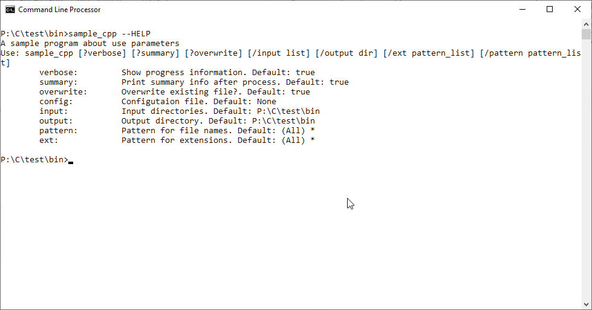

```{r setup, include=FALSE}
knitr::opts_chunk$set(echo = TRUE)
```

## Intro

Para mostrar el uso de la libreria se ha desarrollado un par de programas "muy poco funcionales" en C++ y en C


## Sample

El programa recopila un conjunto de ficheros de diferentes directorios y los copia en otro. 
Si se definen ciertas expresiones regulares o patrones, busca dentro de los archivos y aplica esos cambios

Las opciones que acepta son:


|  Nombre   | Tipo    | Defecto | Multiple |            Descripcion             |
|-----------|---------|---------|----------|------------------------------------|
| verbose   | Flag    | True    | True     | Mostrar informacion                |
| summary   | Flag    | True    | True     | Mostrar resumen                    |
| overwrite | Flag    | True    | True     | Sobreescribir ficheros existentes  |
| config    | Opcion  | N/A     | False    | Fichero de configuracion **existente** |
| input     | Opcion  | .       | True     | Directorio de entrada **existente** |
| output    | Opcion  | .       | True     | Directorio de salida               |
| pattern   | Opcion  | *       | True     | Patron de nombresde ficheros       |
| ext       | Opcion  | *       | True     | Patron de extensiones de ficheros  |
| ...       | Defines | N/A     | True     | Patrones de sustitucion            |


Para las pruebas se ha creado el siguiente entorno:

## Casos de uso

### Ayuda

El flag de ayuda está soportado por defecto en las siguientes versiones:

- -h
- --help
- +help
- +HELP

Notese que se soporta la forma clásica de ayuda: `-h` y `--help` por su uso extendido y por que no tiene sentido desactivar la ayuda: `-help`

#### Ayuda

En los casos en que la libreria se configura como sensible a mayúsculas se soporta dos tipos de ayuda a las que se ha denominado _simple_ y _detallada_, el objetivo es ofrecer la opcion de mostrar una ayuda mas simple o una ayuda mas detallada en función de las caracteristicas del programa.

#### Ayuda simple

Los siguientes comandos son equivalentes:

- sample -h
- sample --help
- sample +h
- sample +he
- sample +help


comando: `sample -h`

```{r echo=FALSE, fig.cap="Help detallado. Modo clasico", out.width = '100%'}
knitr::include_graphics("samplecpp_help_01.png")
```

comando: `sample +h`

```{r echo=FALSE, fig.cap="Help detallado. Modo normal", out.width = '100%'}
knitr::include_graphics("samplecpp_help_02.png")
```

comando: `sample +he`

```{r echo=FALSE, fig.cap="Help detallado. Modo abreviado", out.width = '100%'}
knitr::include_graphics("samplecpp_help_03.png")
```

comando: `sample +help`

```{r echo=FALSE, fig.cap="Help detallado. Modo completo", out.width = '100%'}
knitr::include_graphics("samplecpp_help_04.png")
```

#### Ayuda detallada

El objetivo es poder mostrar una ayuda mas detallada

Los siguientes comandos son equivalentes:

- sample --HELP
- sample +H
- sample +HE
- sample +HELP


comando: `sample --HELP`

```{r echo=FALSE, fig.cap="Help simple. Modo clasico", out.width = '100%'}

```

comando: `sample +H`

```{r echo=FALSE, fig.cap="Help simple. Modo normal", out.width = '100%'}
knitr::include_graphics("samplecpp_help_12.png")
```

comando: `sample +HE`

```{r echo=FALSE, fig.cap="Help simple. Modo abreviado", out.width = '100%'}
knitr::include_graphics("samplecpp_help_13.png")
```

comando: `sample +HELP`

```{r echo=FALSE, fig.cap="Help simple. Modo completo", out.width = '100%'}
knitr::include_graphics("samplecpp_help_14.png")
```


## Exceptions

En C++ los errores son gestionados a través de `CmdLineException`.
El programa ejemplo `sample_exceptions` no realiza ninguna función pero acepta todos los tipos preestablecidos de parámetros.

Por simplicidad unicamente se captura la excepción base, pero la salida indica el tipo de excepción concreta generada.

